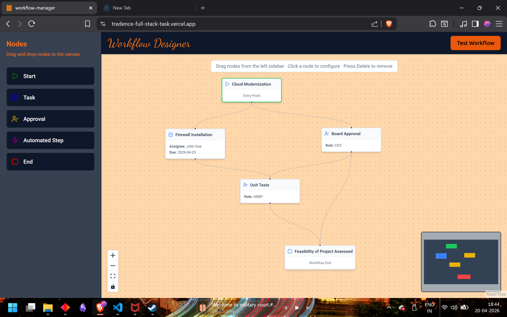
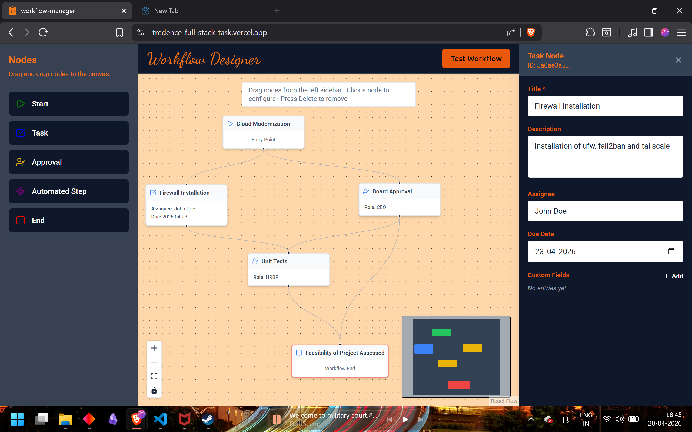
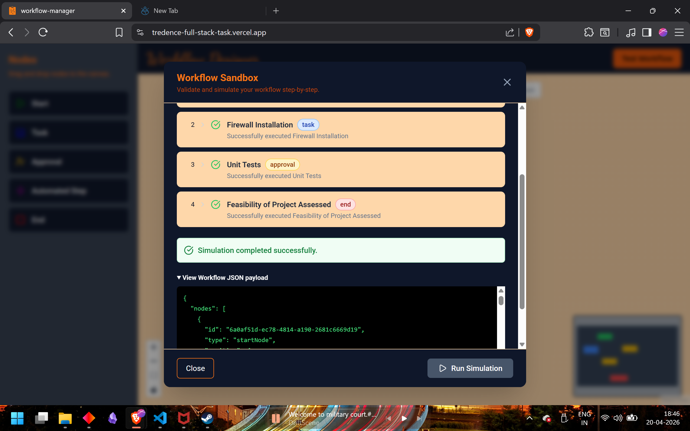

# HR Workflow Designer

A functional prototype of an HR Workflow Designer module built with React, TypeScript, React Flow, and TailwindCSS.

## Preview 

### Home Canvas


### Node Configuration Panel


### Simulation Sandbox


## Getting Started


```bash
npm install
npm run dev
```

---

## Architecture

```
src/
├── api/                  # Mock API layer (simulates GET /automations, POST /simulate)
│   └── mockApi.ts
├── components/
│   ├── Canvas/           # React Flow canvas and drop logic
│   │   └── WorkflowCanvas.tsx
│   ├── Forms/            # Dynamic node configuration panel
│   │   └── NodeConfigPanel.tsx
│   ├── Nodes/            # Custom React Flow node components
│   │   ├── index.tsx     # All 5 node types
│   │   └── NodeWrapper.tsx
│   ├── Sandbox/          # Simulation panel and execution log
│   │   └── SimulationPanel.tsx
│   ├── UI/               # Shared UI (Sidebar)
│   │   └── Sidebar.tsx
│   └── Layout.tsx        # Main layout shell
├── store/
│   └── WorkflowContext.tsx  # Global state via React Context
├── types/
│   └── workflow.ts       # TypeScript interfaces for all node data and API types
└── utils/
    └── validateWorkflow.ts  # Graph validation and cycle detection
```

---

## Design Decisions

### State Management — React Context
Chose React Context over Zustand/Redux to avoid adding extra dependencies and keep the solution self-contained. The `WorkflowContext` owns all React Flow state (`nodes`, `edges`, `selectedNodeId`) and exposes `updateNodeData` so any component can patch a node's data without coupling to the canvas.

### Custom Nodes
Each node type is a separate component that reads typed `data` from React Flow's node props. They are visually color-coded by type:
- 🟢 Start — Green border
- 🔵 Task — Default (blue accent on select)
- 🟡 Approval — Amber border
- 🟣 Automated — Purple border
- 🔴 End — Red border

### Dynamic Form Panel
`NodeConfigPanel` uses a `switch` on `node.type` to render the appropriate sub-form. Each sub-form is a controlled component that calls `updateNodeData()` on every field change. This makes it trivially easy to add new node types — just add a case to the switch and a new form component.

### Mock API
`mockApi.ts` simulates network latency with `setTimeout` delays and returns typed data. `getAutomations()` returns a list of available actions; `simulate()` performs a graph traversal, builds a step log, and detects cycles and missing End nodes during execution.

### Workflow Validation
`validateWorkflow.ts` performs pre-simulation checks:
- Exactly one Start node
- At least one End node
- No disconnected nodes
- No cycles (DFS-based detection)

Errors/warnings are surfaced in the Simulation Panel before the mock API is called.

---

## Assumptions

1. Workflows are linear or branching trees — no merge/join semantics needed.
2. The simulation follows the **first outgoing edge** from each node (deterministic for demo purposes).
3. No backend persistence — all state is in-memory.
4. No authentication layer required.

---

## Bonus Features Implemented

- ✅ JSON payload viewer in Sandbox panel
- ✅ MiniMap and Controls in the canvas
- ✅ Animated step-by-step simulation log
- ✅ Cycle detection
- ✅ Git version tracking

## Tech Stack

| Layer | Tech |
|-------|------|
| Framework | Vite + React + TypeScript |
| Canvas | `@xyflow/react` (React Flow v12) |
| Styling | TailwindCSS v3 |
| Icons | `lucide-react` |
| IDs | `uuid` |
